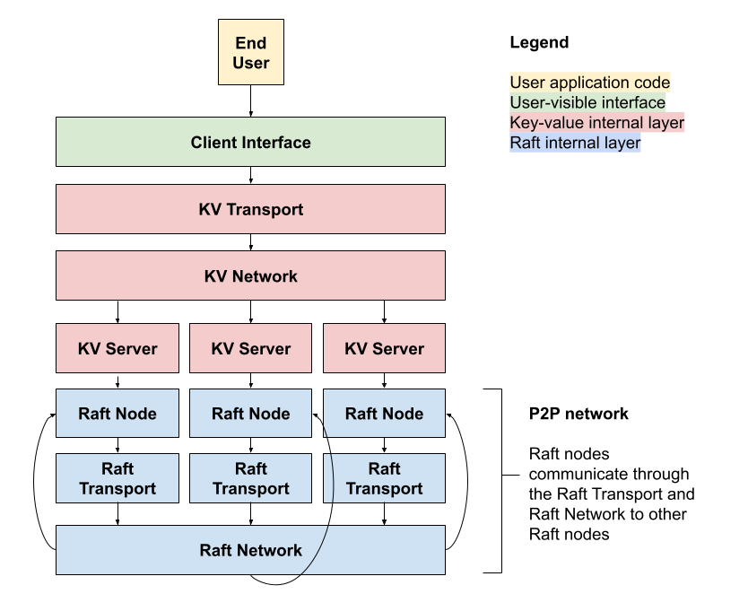

# Architecture

My Raft key-value store implementation uses a layered approach to manage state and communication between the end user, key value store, and raft P2P network.

## Diagram

## Overview
My implementation is designed to be used by an end user (yellow) who communicates with the API via a client interface (green).

The client interface exposes only necessary `Get`, `Set`, and `Delete` methods to the end user. Networking details and all other internal workings are hidden from developers.

Internally, there are two logical models, `raft` for Raft and `kv` for the key-value interface, and one simulation `sim` model.

## Deviations from Raft Paper

I deviated from the original Raft paper several times due to issues I encountered throughout the development process. That said, I implemented the entire protocol except for the configuration changes (changing how many nodes there are in the cluster). Thus, a real utilization of this implementation (which I by no means recommend) would have to experience downtime to change configurations.

### Sentinel Logs

The first entry in any log is a sentinel entry which encodes snapshot information. It uses the existing fields (`Term`, `Index`, and `Command`) to allow the node to calculate how much information is hidden by the persistent snapshot. `Command` is always `nil`, but `Term` and `Index` represent the term and index of the last snapshotted log item.

### PreVote

To solve the known network partition false term incrementation problem, I included PreVote in my implementation. PreVote is an additional RPC that prevents a lone node from going rogue and increasing its term number, thereby overwriting any majority entries from the rest of the cluster. PreVote makes a noncommital preelection--if a node cannot win, it will not start an election, and nodes will not mark that they have voted due to receiving a prevote. For more information about how and why I implemented PreVote, see the [README file](../README.md).

### Generation Counting

Because server restarts happen in memory without the instantiation of new servers, I implemented a generation system during the early phases of development and decided to leave it in since this implementation is for testing only. The generation system allows a function running a timer to realize that it is outdated, i.e. from a previous restart, witohut introducing `nil` pointers or other potential memory errors. The Raft node simply increments its generation upon death, and timer-based goroutines simply snapshot their generation upon instantiation for comparison each time they should execute.

### Persistence

Since no physical reboots will occur in this testing environment, persistence is managed through a simpler memory module which stores the state as variables. The fields marked as persistent by the Raft paper are persistent here as well. For simplicity, the persistence manager also stores snapshot data.

### Duplication Prevention

Although all operations in the key-value store are idempotent, I decided to implement duplication protection mechanisms at the apply layer. This means that duplicate entries are committed to the log but do not affect the state. Thus, nonidempotent operations are supported. Observe that duplicating log entries does not violate linearizability since the resulting duplicated entries do not write to state. Although this technically isn't a deviation from the Raft paper, it is a significant design decision I made when developing the key-value store.

## Module Specifics

### Raft Module

The `raft` module implements the core Raft protocol according to the [Raft paper](https://raft.github.io/raft.pdf).

Per the paper, internode communication uses RPC interfaces. Encoding is not provided; the `raft` layer is agnostic to the underlying transport and network layers.

The `raft` module is divided into four files.

`raft.go` houses the primary `Raft` struct that represents a node in the server. This code would be instantiated by a standalone server in a real network.

`persistence.go` specifies methods to be implemented by a persister. Normally, this would be a disk storage system that persists over machine power cycles.

`memory_persister.go` provides a simple in-memory persister that is good enough for simulated crashes.

`rpc.go` specifies the methods implemented by the transport. See `sim` for testing implementations of these methods.

### KV Module

The `kv` module provides a layer for the management of simple key-value storage over the Raft protocol.

For consistency, `kv` is also network-agnostic. The client API for the `kv` module does not require any-to-any communciation, however, so the `kv` servers that live on top of the `raft` servers do not own a transport. Rather, the client centrally connects to each `kv` server.

The `kv` module is divided into four files.

`command.go` specifies an encoding scheme for commands to be committed to the `raft` log.

`rpc.go` specifies RPCs for use between the clients and `kv` servers.

`server.go` implements the `kv` server. The `kv` server receives `kv` RPCs from the client and sends them to the `raft` node. It also manages an internal key-value state machine that receives commands from the `raft` node's apply channel.

`client.go` implements the front-facing client interface. It provides high-level methods to read (`Get`), write (`Set`), and delete (`Delete`).

### Sim Module

The `sim` module implements a fake network and some clustering utility functions for testing only. In production code, the `sim` module would not be shipped with the library; another networking module would have to be implemented for distributed control.

The specifics of the `sim` module are specifics of testing, not production, so they are included in [the testing documentation](testing.md).

## Known Limitations

I intentionally left out some extension features of the original Raft paper and a proper networking setup.

### Cluster Membership

I did not implement cluster membership for this project. There are a few reasons why I chose not to write this:

1. I am not implementing distributed (separate-process or separate-machine) testing.
2. I am not implementing a real networking protocol.
3. I am not implementing any type of dynamic spawning of servers or a load distributor.

Without these, cluster membership changes were not a very valuable use of my time, since my goal with this project was to develop an understanding of consensus algorithms and how information propagates across distributed systems with integrity.

### Networking

For similar reasons as for cluster membership, I chose not to implement a proper networking system. Again, my goal was to learn consensus and Raft. Learning how to implement networking in a new programming language would be an interesting challenge for another time, but I had a specific goal with this project and I attained it. Since this is my first Go project, it also would have been quite ambitious.
